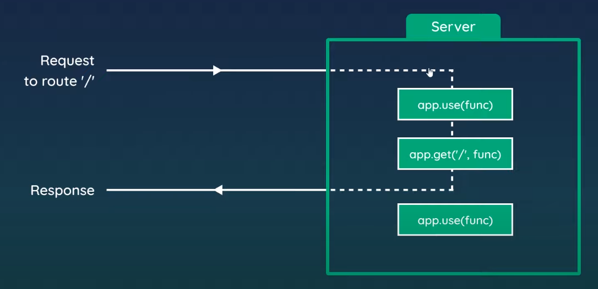

# What is a middleware?
Middleware is software that lies between an operating system and the applications running on it. Essentially functioning as hidden translation layer, middleware enables communication and data management for distributed applications.

# Middleware in Express
Express middleware are functions that execute during the lifecycle of a request to the Express server. Each middleware has access to the HTTP request and response for each route (or path) it's attached to. In fact, Express itself is compromised wholly of middleware functions.

## Examples:

- Logger middleware to log details of every request
- Authentication check middleware for protected routes
- Middleware to parse JSON data from requests
- Return 404 pages

# Example 3rd-party Middlewares

- morgan: HTTP request logger middleware for node.js (https://www.npmjs.com/package/morgan)
