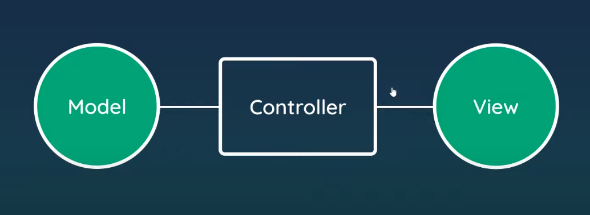

# Express Router

We gonna use Express Router to split routes into files. This makes app.js file more clean and readable.
Move out the blog routes codes into `routes/blogRoutes.js` file using Express Router. And import it from `app.js` file.

Finally, active the routes: `app.use(blogRoutes)`

# MVC

## Basics

- Stands for Model, View, and Controller.
- MVC is a way of structuring our code & files.
- Keeps code more modular, reusable, and easier to read.

## Re-organizing project structure to apply MVC.

Create a folder named as `controllers` and create a file named as `blogContoller.js` inside the directory.
Move the methods into the created controller from `blogRoutes.js` and use the methods to connect the blog routes to controller.

Example: [controllers/blogController.js](controllers/blogController.js)